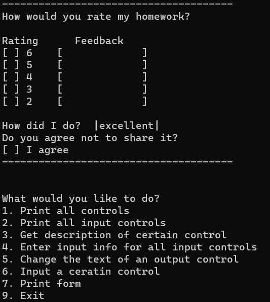

# CLI-Forms
A basic console forms application

This program was given to me as a homework for the Object-Oriented Programming Course at FMI, Sofia University.

Here is an example photo:

The picture shows all of the supported types of forms!
The form's data is located at `FormsApp/Forms/Homework.txt`